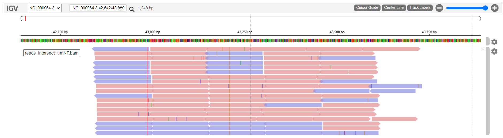

```{r setup, include=FALSE}
knitr::opts_chunk$set(eval=FALSE, echo =TRUE, cache = FALSE, message = FALSE, warning = FALSE, cache.lazy = FALSE,
                      fig.height = 3.5, fig.width = 10.5)

setwd("/shared/home/gcastel/M4M5/EvaluationM4M5")
```

# Consignes {-}

Complétez ce document en remplissant les chunks vides pour écrire le code qui vous a permis de répondre à la question. Les réponses attendant un résultat chiffré ou une explication devront être insérées entre le balises html `code`. Par exemple pour répondre à la question suivante :

    La bioinfo c'est : <code>MERVEILLEUX</code>.
    
N'hésitez pas à commenter votre code, enrichir le rapport en y insérant des résultats ou des graphiques/images pour expliquer votre démarche. N'oubliez pas les **bonnes pratiques** pour une recherche **reproductible** !
Nous souhaitons à minima que l'analyse soit reproductible sur le cluster de l'IFB.

# Introduction {-}

Vous allez travailler sur des données de reséquençage d'un génome bactérien : _Bacillus subtilis_. Les données sont issues de cet article :

* [Complete Genome Sequences of 13 Bacillus subtilis Soil Isolates for Studying Secondary Metabolite Diversity](https://mra.asm.org/content/9/2/e01406-19)

# Analyses

## Organisation de votre espace de travail

````{bash}
#tree
#  .
#  ├── ALIGNMENT
#  ├── CLEANING
#  ├── css
#  │   └── style.css
#  ├── Evaluation.html
#  ├── EvaluationM4M5.Rproj
#  ├── Evaluation.Rmd
#  ├── FASTQ
#  ├── images
#  │   ├── inrae.png
#  │   └── migale-orange.png
#  ├── LOG
#  ├── OUTPUT
#  ├── QC
#  ├── README.md
#  ├── REF_GENOME
#  ├── resources
#  │   ├── biblio.bib
#  │   ├── biomed-central.csl
#  │   └── footer.html
#  └── SCRIPTS

```

## Téléchargement des données brutes

Récupérez les fichiers FASTQ issus du run **SRR10390685** grâce à l'outil <strong class="tool">sra-tools</strong> @sratoolkit

```{bash}
#sbatch SCRIPTS/fasterq_script.sh

#cat SCRIPTS/fasterq_script.sh

  #!/bin/bash

  #SBATCH --cpus-per-task=8
  #SBATCH --mem=40G
  #SBATCH --output=OUTPUT/compress_fastq-%j.out
  #SBATCH --error=LOG/compress_fastq-%j.err

  #module load  sra-tools
  #srun --cpus-per-task=8 fasterq-dump --split-files -p SRR10390685 --outdir FASTQ

#sbatch SCRIPTS/compress_fastq_script.sh

#cat SCRIPTS/compress_fastq_script.sh

  #!/bin/bash

  #SBATCH --mem=40G
  #SBATCH --output=OUTPUT/compress_fastq-%j.out
  #SBATCH --error=LOG/compress_fastq-%j.err
  
  #srun gzip FASTQ/*.fastq
```

Combien de reads sont présents dans les fichiers R1 et R2 ?

```{bash}
#sbatch SCRIPTS/nb_reads_script.sh 

  #!/bin/bash
  
  #SBATCH --cpus-per-task=8
  #SBATCH --mem=40G
  #SBATCH --output=OUTPUT/nb_reads-%j.out
  #SBATCH --error=LOG/nb_reads-%j.err
  
  #module load seqkit
  #srun seqkit stats --threads 8 FASTQ/*.fastq.gz > RESULTS/nb_reads_res

#cat RESULTS/nb_reads_res 
  #file                          format  type   num_seqs        sum_len  min_len  avg_len  max_len
  #FASTQ/SRR10390685_1.fastq.gz  FASTQ   DNA   7,066,055  1,056,334,498       35    149.5      151
  #FASTQ/SRR10390685_2.fastq.gz  FASTQ   DNA   7,066,055  1,062,807,718      130    150.4      151
```

Les fichiers FASTQ contiennent <code>7066055</code> reads.

Téléchargez le génome de référence de la souche ASM904v1 de _Bacillus subtilis_ disponible à [cette adresse](https://ftp.ncbi.nlm.nih.gov/genomes/all/GCF/000/009/045/GCF_000009045.1_ASM904v1/GCF_000009045.1_ASM904v1_genomic.fna.gz)

```{bash}
#sbatch SCRIPTS/ref_genome_script.sh

  #!/bin/bash

  #SBATCH --mem=40G
  #SBATCH --output=OUTPUT/ref_genome-%j.out
  #SBATCH --error=LOG/ref_genome-%j.err

  #srun wget https://ftp.ncbi.nlm.nih.gov/genomes/all/GCF/000/009/045/GCF_000009045.1_ASM904v1/GCF_000009045.1_ASM904v1_genomic.fna.gz -O REF_GENOME/ref_genome.fna.gz

```

Quelle est la taille de ce génome ?

```{bash}
#zcat REF_GENOME/ref_genome.fna.gz |grep -v "^>"|tr --delete "\n"|wc -c
#  4215606
```

La taille de ce génome est de <code>4215606</code> paires de bases.

Téléchargez l'annotation de la souche ASM904v1 de _Bacillus subtilis_ disponible à [cette adresse](https://ftp.ncbi.nlm.nih.gov/genomes/all/GCF/000/009/045/GCF_000009045.1_ASM904v1/GCF_000009045.1_ASM904v1_genomic.gff.gz)

```{bash}
#sbatch SCRIPTS/ref_genome_annotation_script.sh

#cat SCRIPTS/ref_genome_annotation_script.sh
  #!/bin/bash
  
  #SBATCH --mem=40G
  #SBATCH --output=OUTPUT/ref_genome_annotation-%j.out
  #SBATCH --error=LOG/ref_genome_annotation-%j.err

  #srun wget https://ftp.ncbi.nlm.nih.gov/genomes/all/GCF/000/009/045/GCF_000009045.1_ASM904v1/GCF_000009045.1_ASM904v1_genomic.gff.gz -O REF_GENOME/ref_genome_annotation.gff.gz

```

Combien de gènes sont connus pour ce génome ?

```{bash}
#wc -l <(zgrep -v "^#" REF_GENOME/ref_genome_annotation.gff.gz  |awk '$3=="gene"' )
  #4448 /dev/fd/63
```

<code>4448</code> gènes sont recensés dans le fichier d'annotation.

## Contrôle qualité

Lancez l'outil <strong class="tool">fastqc</strong> @fastqc dédié à l'analyse de la qualité des bases issues d'un séquençage haut-débit

```{bash}
#sbatch SCRIPTS/fastqc_script.sh

#cat SCRIPTS/fastqc_script.sh 
  #!/bin/bash
  
  #SBATCH --mem=40G
  #SBATCH --output=OUTPUT/qc-%j.out
  #SBATCH --error=LOG/qc-%j.err
  #SBATCH --cpus-per-task=8
  
  #module load fastqc
  
  #srun fastqc FASTQ/SRR10390685_1.fastq.gz -o QC/ -t 8
  #srun fastqc FASTQ/SRR10390685_2.fastq.gz -o QC/ -t 8
  
#ls QC/
  #SRR10390685_1_fastqc.html  SRR10390685_1_fastqc.zip  SRR10390685_2_fastqc.html  SRR10390685_2_fastqc.zip

```

La qualité des bases vous paraît-elle satisfaisante ? Pourquoi ?

- [X] Oui
- [ ] Non


car <code>aucun read n'a été "taggé" de basse qualité</code> comme le montre <code>le tableau des statistiques de bases du contrôle qualité ("Basic Statistics")</code>

A noter cependant que <code>la qualité par base diminue vers la fin des reads</code>. Bien que la <code>qualité moyenne</code> soit toujours <code>très haute (>34)</code>, l'écart type (barre d'erreur) montre que <code>pour certains reads, les dernières bases ont une qualité très faible(<20)</code>. Cet effet est un peu <code>plus marqué pour les reads 2</code>, ce qui peut être dû à <code>l'overclustering de la flow cell</code> résultant des cycles de PCR supplémentaires par rapport aux reads 1, et peutt-être aussi à cause d'une <code>dégardation partielle</code> de l'ADN dans le temps au cours du séquençage <code>(lasers + traitements chimiques...)</code> étant donné que les reads 2 sont séquencés après les reads 1.

On voit qu'il y a un problème au niveau de la section : "Per base sequence content". Ce warning peut apparaître
lorsque la différence entre A et T ou entre G et C est supérieure à 10% pour une position donnée. Ici, on voit que ce sont les positions 1-9 et 150-151 qui posent problème. On pourra par la suite "trimmer" les reads pour ces positions.

Par ailleurs, on observe une <code>sur-représentation des bases AT (28% chacune)</code> par rapport aux GC (22% chacune). Mais après recherche sur [NCBI](https://www.ncbi.nlm.nih.gov/genome/?term=Bacillus%20subtilis%5BOrganism%5D&cmd=DetailsSearch), il s'avère que <code>c'est normal</code>, car le taux médian de <code>GC</code> du génome est de <code>43.6%</code> (~2*22%).

Malgré le warning, la très grande <code>majorité des reads</code> ont la même longueur : <code>151 bp</code>, ce qui correspond à la longueur de séquençage des reads demandée.

Un warning alerte sur le niveau de duplication des reads, mais il reste acceptable étant donné qu'il s'agit de séquences génomiques qui peuvent contenir des duplications naturelles (superfamilles de gènes, insertion de séquences virales, quelques transposons...)

On note aussi la détection d'une séquence de 35 nucléotides non identifiés ('N') qui est sur-représentée (0.13%) dans les reads 1. On voit d'ailleurs que sa taille correspond aux plus petits reads détectés, on peut penser qu'il s'agit d'un contaminant, ou duplex de primers ... ?

````{bash}
#cat RESULTS/nb_reads_res 
#  file                          format  type   num_seqs        sum_len  min_len  avg_len  max_len
#  FASTQ/SRR10390685_1.fastq.gz  FASTQ   DNA   7,066,055  1,056,334,498       35    149.5      151
#  FASTQ/SRR10390685_2.fastq.gz  FASTQ   DNA   7,066,055  1,062,807,718      130    150.4      151
````


On retrouve également une séquence de 50 'G' sur-représentée dans les reads 2 (0.11%), mais celle-ci peut correspondre à des régions répétées du génome bactérien.

Lien vers le [rapport FastQC r1](https://gaelcastel.github.io/EvaluationM4M5/QC/SRR10390685_1_fastqc.html) et [rapport FastQC r2](https://gaelcastel.github.io/EvaluationM4M5/QC/SRR10390685_2_fastqc.html)

Est-ce que les reads déposés ont subi une étape de nettoyage avant d'être déposés ? Pourquoi ?

- [X] Oui
- [ ] Non

car <code>Certains reads ont des longueurs différentes. Or, dans les données brutes, les reads ont tous la même longueur.</code>

Quelle est la profondeur de séquençage (calculée par rapport à la taille du génome de référence) ?

```{bash}
#cat RESULTS/nb_reads_res 
#  file                          format  type   num_seqs        sum_len  min_len  avg_len  max_len
#  FASTQ/SRR10390685_1.fastq.gz  FASTQ   DNA   7,066,055  1,056,334,498       35    149.5      151
#  FASTQ/SRR10390685_2.fastq.gz  FASTQ   DNA   7,066,055  1,062,807,718      130    150.4      151
#
#zcat REF_GENOME/ref_genome.fna.gz |grep -v "^>"|tr --delete "\n"|wc -c
#  4215606
#
#
#expr $(expr 1056334498 + 1062807718) / 4215606
#  502

```

La profondeur de séquençage est de : <code>502</code> X.

## Nettoyage des reads

Vous voulez maintenant nettoyer un peu vos lectures. Choisissez les paramètres de <strong class="tool">fastp</strong> @fastp qui vous semblent adéquats et justifiez-les.

NB : je vais réessayer en trimmant les extrémités des reads car elles leur score de qualité est faible.

```{bash}
#sbatch SCRIPTS/reads_cleaning_script.sh

#cat SCRIPTS/reads_cleaning_script.sh 
#  #!/bin/bash
#  
#  #SBATCH --mem=40G
#  #SBATCH --output=OUTPUT/cleaning-%j.out
#  #SBATCH --error=LOG/cleaning-%j.err
#  #SBATCH --cpus-per-task=8
#  
#  module load fastp
#  
#  srun  fastp --in1 FASTQ/SRR10390685_1.fastq.gz --in2 FASTQ/SRR10390685_2.fastq.gz --out1 CLEANING/SRR10390685_1.cleaned_filtered.fastq.gz --out2 CLEANING/SRR10390685_2.cleaned_filtered.fastq.gz --html CLEANING/fastp.html --thread 8 --cut_mean_quality 28 --cut_window_size 8 --length_required 36 --cut_tail --json CLEANING/fastp.json

#head -n 32 CLEANING/fastp.json
  #{
  #        "summary": {
  #                "before_filtering": {
  #                        "total_reads":14132110,
  #                        "total_bases":2119142216,
  #                        "q20_bases":1965312048,
  #                        "q30_bases":1884626239,
  #                        "q20_rate":0.927409,
  #                        "q30_rate":0.889334,
  #                        "read1_mean_length":149,
  #                        "read2_mean_length":150,
  #                        "gc_content":0.436572
  #                },
  #                "after_filtering": {
  #                        "total_reads":13828988,
  #                        "total_bases":2039306991,
  #                        "q20_bases":1915713257,
  #                        "q30_bases":1843322035,
  #                        "q20_rate":0.939394,
  #                        "q30_rate":0.903896,
  #                        "read1_mean_length":147,
  #                        "read2_mean_length":147,
  #                        "gc_content":0.435897
  #                }
  #        },
  #        "filtering_result": {
  #                "passed_filter_reads": 13828988,
  #                "low_quality_reads": 250596,
  #                "too_many_N_reads": 3694,
  #                "too_short_reads": 48832,
  #                "too_long_reads": 0
  #        },

```

Les paramètres suivants ont été choisis : 


|                  Parametre                  | Valeur |                              Explication                          |
|:-------------------------------------------:|:------:|:-----------------------------------------------------------------:|
| --length_required                           |   36   |La section "Overrepresented sequences" du fastqc des reads 1<br>indique une séquence surreprésentée de 35 nucléotides non<br>identifiés "N". Comme les reads font majoritairement autour<br>de 150 bp, on va éliminer tous les reads dont la longueur est<br>inférieure à 36 bp pour éliminer ces séquences de 35 "N",<br> sans risquer d'éliminer des reads d'intérêt.|
| --cut_tail                                  |   NA   |Le programme va lire les reads depuis l'extrémité 3' pour dé-<br>terminer s'ils seront conservés ou éliminés selon les<br>critères de qualité définis par nous (cf ci-dessous).|
| --cut_window_size                           |    8   |Le programme va lire les reads par morceaux de 8 bp.| 
| --cut_mean_quality                          |   28   |La section "Per sequence quality scores" du fastqc montre que<br>le très grande majorité des séquences ont un score > 28. On<br>va donc éliminer celles dont le score est < 28, en<br>considérant qu'ils sont de qualité médiocre, et qu'ils ne<br>représentent qu'une part négligeable des reads totaux. Ce<br>paramètre est utilisé en coopération avec --cut_tail et<br>--cut_window_size 8. Ainsi, le programme va parcourir le read<br>depuis l'extrémité 3' (--cut_tail) par fenêtre de 8 bp<br>(--cut_window_size 8) en les éliminant si leur score de<br>qualité moyen est < 28.| 


De plus, fastp va automatiquement détecter les adaptateurs et les éliminer des reads (il va les "trim"). Pour que le programme s'exécute plus rapidement, on le fait tourner sur 8 coeurs (--thread 8). Pour la sortie des rapports, on spécifie
deux formats : --json et --html.

Ces paramètres ont permis de conserver <code>6914494</code> reads pairés (13828988/2), soit une perte de <code>2.14</code>% des reads bruts (100-6914494/7066055*100).

## Alignement des reads sur le génome de référence

Maintenant, vous allez aligner ces reads nettoyés sur le génome de référence à l'aide de <strong class="tool">bwa</strong> @bwa et <strong class="tool">samtools</strong> @samtools.

```{bash}
#Tout d'abord, on indexe le génome de référence

#sbatch SCRIPTS/index_genome_script.sh 

#cat SCRIPTS/index_genome_script.sh 
#  #!/bin/bash
#  
#  #SBATCH --mem=40G
#  #SBATCH --output=OUTPUT/index_genome-%j.out
#  #SBATCH --error=LOG/index_genome-%j.err
#  
#  module load bwa
#
#  srun bwa index REF_GENOME/ref_genome.fna.gz
```

```{bash}

#Ensuite, on aligne les reads paired-end sur le génome indexé
#
#sbatch SCRIPTS/align_to_genome_script.sh
#
#cat SCRIPTS/align_to_genome_script.sh 
#  #!/bin/bash
#  
#  #SBATCH --mem=40G
#  #SBATCH --output=OUTPUT/align_to_genome-%j.out
#  #SBATCH --error=LOG/align_to_genome-%j.err
#  #SBATCH --cpus-per-task=8
#  
#  srun bwa mem -t 8 REF_GENOME/ref_genome.fna.gz CLEANING/SRR10390685_1.cleaned_filtered.fastq.gz CLEANING/SRR10390685_2.cleaned_filtered.fastq.gz > ALIGNMENT/SRR10390685_aligned_paired.sam

```

Combien de reads ne sont pas mappés ?

```{bash}
#On va d'abord convertir le fichier .sam en fichier .bam, plus simple à traiter par les outils d'analyse (fichier binaire)

#sbatch SCRIPTS/sam_to_non_filtered_bam_script.sh

#cat SCRIPTS/sam_to_non_filtered_bam_script.sh 
#  #!/bin/bash
#  
#  #SBATCH --mem=40G
#  #SBATCH --output=OUTPUT/sam_to_bam-%j.out
#  #SBATCH --error=LOG/sam_to_bam-%j.err
#  #SBATCH --cpus-per-task=8
#  
#  module load samtools
#  
#  srun samtools view -hbS --threads 8 -o ALIGNMENT/SRR10390685_aligned_paired_non_filtered.bam  ALIGNMENT/SRR10390685_aligned_paired.sam

#Ensuite, on va trier les reads du fichier SRR10390685_aligned_paired_non_filtered.bam par ordre de leurs coordonnées de mapping sur le génome.

#sbatch SCRIPTS/sort_non_filtered_bam_script.sh

#cat SCRIPTS/sort_non_filtered_bam_script.sh 
#  #!/bin/bash
#  
#  #SBATCH --mem=40G
#  #SBATCH --output=OUTPUT/sort_bam-%j.out
#  #SBATCH --error=LOG/sort_bam-%j.err
#  #SBATCH --cpus-per-task=8
#  
#  module load samtools
#  
#  srun samtools sort --threads 8 -o ALIGNMENT/SRR10390685_aligned_paired_sorted_non_filtered.bam ALIGNMENT/SRR10390685_aligned_paired_non_filtered.bam

#Enfin, nous allons déterminer combien de reads ont été mappés sur le génome

#sbatch SCRIPTS/non_filtered_counts_reads_mapped_to_genome_script.sh

#cat SCRIPTS/non_filtered_counts_reads_mapped_to_genome_script.sh
#
#  #!/bin/bash
#  
#  #SBATCH --mem=40G
#  #SBATCH --output=OUTPUT/count_reads.out
#  #SBATCH --error=LOG/count_reads-%j.err
#  #SBATCH --cpus-per-task=8
#  
#  module load samtools
#  
#  samtools flagstat --threads 8 ALIGNMENT/SRR10390685_aligned_paired_sorted_non_filtered.bam

#cat OUTPUT/count_reads.out 
#13847147 + 0 in total (QC-passed reads + QC-failed reads)
#0 + 0 secondary
#18159 + 0 supplementary
#0 + 0 duplicates
#13085939 + 0 mapped (94.50% : N/A)
#13828988 + 0 paired in sequencing
#6914494 + 0 read1
#6914494 + 0 read2
#13002480 + 0 properly paired (94.02% : N/A)
#13025902 + 0 with itself and mate mapped
#41878 + 0 singletons (0.30% : N/A)
#0 + 0 with mate mapped to a different chr
#0 + 0 with mate mapped to a different chr (mapQ>=5)

```


<code>719330</code> reads (13847147 total -13085939 mapped -41878 singletons) ne sont pas mappés, soit environ 5.2% des reads. Il faut noter que certains reads ont été mappés mais pas leur paired read, c'est ce qu'on appelle des singletons. Par conséquent, le nombre de reads pairés mappés est de 13085939 (=mapped), soit environ 94.50%.

## Croisement de données

Calculez le nombre de reads qui chevauchent avec au moins 50% de leur longueur le gène _trmNF_ grâce à l'outil <strong class="tool">bedtools</strong> @bedtools:

```{bash}
#sbatch SCRIPTS/trmNF_gene_annotation_script.sh

#cat SCRIPTS/trmNF_gene_annotation_script.sh
#  #!/bin/bash
#  
#  #SBATCH --mem=40G
#  #SBATCH --output=OUTPUT/trmNF_annotation-%j.out
#  #SBATCH --error=LOG/trmNF_annotation-%j.err
#  
#  srun zgrep trmNF REF_GENOME/ref_genome_annotation.gff.gz | awk '$3=="gene"' > RESULTS/trmNF_gene_annotation.gff3

#Il faut indexer le génome de référence avec la commande faidx de samtools. Elle reçoit un fichier fasta en input. Il faut donc gunziper le génome de référence au préalable.

#gunzip -c REF_GENOME/ref_genome.fna.gz > REF_GENOME/ref_genome.fna

#sbatch SCRIPTS/fasta_index_script.sh

#cat SCRIPTS/fasta_index_script.sh 
#  #!/bin/bash
#  
#  #SBATCH --mem=40G
#  #SBATCH --output=OUTPUT/ref_genome_annotation-%j.out
#  #SBATCH --error=LOG/ref_genome_annotation-%j.err
#  
#  module load samtools
#  
#  srun samtools faidx REF_GENOME/ref_genome.fna

#Il faut créer le fichier my_genome pour pouvoir lancer la commande bedtools intersect

#cut -f1,2 REF_GENOME/ref_genome.fna.fai > REF_GENOME/my_genome

#On détermine ensuite les reads qui chevauchent le gène trmNF sur au moins 50% de leur longueur.

#sbatch SCRIPTS/trmNF_instersect_sequence_script.sh

#cat SCRIPTS/trmNF_instersect_sequence_script.sh
#  #!/bin/bash
#  
#  #SBATCH --mem=40G
#  #SBATCH --output=OUTPUT/reads_intersect_trmNF-%j.out
#  #SBATCH --error=LOG/reads_intersect_trmNF-%j.err
#  
#  module load bedtools
#  module load samtools
#  
#  srun bedtools intersect -a ALIGNMENT/SRR10390685_aligned_paired_sorted_non_filtered.bam -b RESULTS/trmNF_gene_annotation.gff3  -sorted -g REF_GENOME/my_genome -f 0.50  > ALIGNMENT/reads_intersect_trmNF.bam
#  srun samtools view -h -o ALIGNMENT/reads_intersect_trmNF.sam ALIGNMENT/reads_intersect_trmNF.bam

#wc -l ALIGNMENT/reads_intersect_trmNF.sam
#  2853 ALIGNMENT/reads_intersect_trmNF.sam

```

<code>2853</code> reads chevauchent le gène d'intérêt sur au moins 50% de leur longueur.


## Visualisation

Utilisez <strong class="tool">IGV</strong> @igv sous [sa version en ligne](https://igv.org/app/) pour visualiser les alignements sur le gène. Faites une capture d'écran du gène entier.

````{bash}
#Pour visualiser les reads trmNF sur le génome au moyen d'IGV, il faut tout d'abord indexer le fichier bam de ces reads qu'on a identifiés à l'étape précédente.

#sbatch SCRIPTS/bam_to_bai_script.sh

#cat SCRIPTS/bam_to_bai_script.sh
#  #!/bin/bash
  
#  #SBATCH --mem=40G
#  #SBATCH --output=OUTPUT/bam_to_bai-%j.out
#  #SBATCH --error=LOG/bam_to_bai-%j.err
#  #SBATCH --cpus-per-task=8
  
#  module load samtools
  
#  srun samtools index -@ 8 ALIGNMENT/reads_intersect_trmNF.bam
````

````{bash local}
#On télécharge ensuite en local les 4 fichiers suivants (le génome de référence, les reads qui chevauchent trmNF et leurs index respectifs), pour pouvoir les uploader vers IGV :

#scp gcastel@core.cluster.france-bioinformatique.fr:/shared/home/gcastel/M4M5/EvaluationM4M5/REF_GENOME/ref_genome.fna .
#scp gcastel@core.cluster.france-bioinformatique.fr:/shared/home/gcastel/M4M5/EvaluationM4M5/REF_GENOME/ref_genome.fna.fai .
#scp gcastel@core.cluster.france-bioinformatique.fr:/shared/home/gcastel/M4M5/EvaluationM4M5/ALIGNMENT/reads_intersect_trmNF.bam .
#scp gcastel@core.cluster.france-bioinformatique.fr:/shared/home/gcastel/M4M5/EvaluationM4M5/ALIGNMENT/reads_intersect_trmNF.bam.bai .

#En zoomant au maximum, on observe les reads qui chevauchent trmNF à la position attendue entre 42.75 kb et 43.75 kb.

````
On peut visualiser les reads qui chevauchent trmNF sur le génome 

## MultiQC

Le rapport MultiQC, qui récapitule la majorité des points que nous avons abordés, est consultable ici : [rapport MultiQC](https://gaelcastel.github.io/EvaluationM4M5/QC/multiqc_report.html)

````{bash multiqc}
#sbatch SCRIPTS/multiqc_script.sh
#
#cat SCRIPTS/multiqc_script.sh 
#  #!/bin/bash
#  
#  #SBATCH --mem=40G
#  #SBATCH --output=OUTPUT/multiqc-%j.out
#  #SBATCH --error=LOG/multiqc-%j.err
#  
#  module load multiqc
#  srun multiqc -d . -o QC""

````


# References