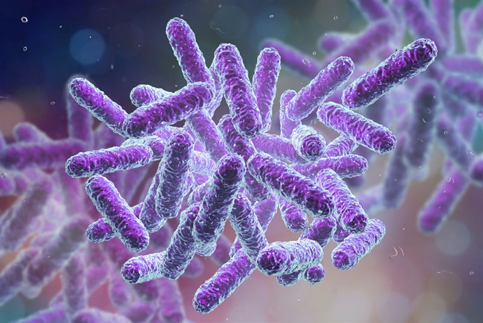

<html>
<head>
<link rel="stylesheet" href="css/style_first_page.css">
<meta http-equiv='cache-control' content='no-cache'> 
<meta http-equiv='expires' content='0'> 
<meta http-equiv='pragma' content='no-cache'>
<b>Gaël Castel Evaluation des modules 4 et 5</b>
</head>
<body>

 
   <h2>Le projet est consultable sur mon dépôt Github, sous le nom de projet : <a href="https://github.com/gaelcastel/EvaluationM4M5">EvaluationM4M5</a>. Les réponses de l'évaluation sont consignées dans ce <a href="https://gaelcastel.github.io/EvaluationM4M5/Evaluation.html">rapport HTML</a>. En lisant ce rapport, vous trouverez les résultats d'une analyse des données de reséquençage du génome de <i>Bacillus subtilis</i>. Ces résultats sont consignés dans ce rapport <a href="https://gaelcastel.github.io/EvaluationM4M5/QC/multiqc_report.html">MultiQC</a>.</h2>

 
</body>
</html> 
